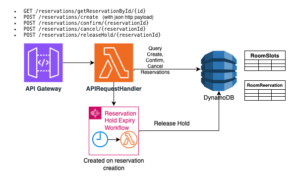

# Escape Room Booking API

## Overview

This project implements an **Escape Room Booking API** that allows users to reserve time slots for escape rooms with a temporary **hold mechanism**. Teams can place a slot on hold for 5 minutes to coordinate before confirming the reservation. The system ensures concurrency safety and provides atomic updates to prevent double-booking.

---

## Functional Requirements & Use Cases

1. **Hold Reservation**  
   Users can create a new reservation, which temporarily reserves a slot for 5 minutes before it is confirmed.

2. **Confirm Reservation**  
   Users can confirm a reservation, converting a HOLD reservation to CONFIRMED.

3. **Cancel Reservation**  
   Users can cancel a reservation they booked.

4. **Release Reservation Hold**  
   The service automatically releases a reservation hold if it is not confirmed within 5 minutes.

---

## Design & Scope Assumptions

**Design Assumptions:**

* There are initially 100 escape rooms, each available 8 hours daily from 12:00 PM to 8:00 PM.
* Each play takes a 1-hour slot (configurable in the future).
* Only one slot per reservation is allowed; consecutive hours require separate reservations.

**Out of Scope:**

* Ingestion of new escape rooms or time slots; small datasets are pre-populated for demonstration.
* User profile data storage.
* Escape room details such as descriptions or pictures.

---

## API Design

**Supported REST APIs:**

* `GET /reservations/getReservationById/{id}`
* `POST /reservations/create` (with JSON payload)
* `POST /reservations/confirm/{reservationId}`
* `POST /reservations/cancel/{reservationId}`
* `POST /reservations/releaseHold/{reservationId}`

**HTTP Response Codes:**

* `2XX` – success
* `4XX` – bad input or unsupported API
* `5XX` – server-side errors

---

## Data Model

**RoomReservations Table**

| Attribute         | Type       | Description                               |
| ----------------- | ---------- | ----------------------------------------- |
| reservationId     | PK, String | UUID                                      |
| roomId            | String     | Room identifier                           |
| slotId            | String     | Date#Hour format (matches RoomSlots table) |
| userId            | String     | User who made the reservation             |
| reservationStatus | Enum       | HOLD / CONFIRMED / CANCELLED / EXPIRED   |
| createdAt         | Number     | Epoch timestamp                           |
| holdExpiresAt     | Number     | Epoch timestamp for hold expiration       |
| lastUpdated       | Number     | Epoch timestamp for optimistic lock       |

**Global Secondary Indexes (GSI):**

* `GSI-userId` → Query reservations quickly by user.
* `GSI-reservationStatus` → Query reservations in HOLD status.

---

**EscapeRoomSlots Table**

Represents all time slots for each escape room and their availability.

| Attribute                 | Type           | Description                                                         |
| ------------------------- | -------------- | ------------------------------------------------------------------- |
| roomId                     | PK, String     | Identifies the escape room.                                         |
| slotId                     | SK, String     | Format: `YYYY-MM-DD#HH` representing date and hour of the slot.     |
| createdTime                | Number         | Epoch seconds when the slot entry was created.                      |
| currentReservationId       | String or null | The active reservation occupying the slot (HOLD or BOOKED). Null if AVAILABLE. |
| lastUpdated                | Number         | Epoch milliseconds of the latest update to this slot record.       |
| slotStatus                 | String         | Status of the slot: `AVAILABLE`, `HOLD`, or `BOOKED`.              |

**Notes:**

* **slotId Format:** Combines date + hour, e.g., `2025-11-19#10`. Supports queries by date and hour ranges.
* **Partition / Sort Keys:** PK = `roomId`, SK = `slotId`, enabling efficient range queries.

---

## High-Level Architecture



### Key Architecture Decisions & Trade-offs

| Decision                                                    | Rationale                                                                                                                                                       | Alternatives                                                                                                                     |
|-------------------------------------------------------------|-----------------------------------------------------------------------------------------------------------------------------------------------------------------|---------------------------------------------------------------------------------------------------------------------------------|
| **DynamoDB** for persistence                                | Simple, scalable, supports transactions, easy to set up                                                                                                         | RDBMS (MySQL/Postgres) – works but requires more setup                                                                          |
| **Step Functions** for hold expiration                      | Reliable async workflow with retries, easy to implement                                                                                                         | 1. Lambda scheduled via EventBridge – wastes resources when no holds exist<br>2. Redis with TTL – complex consistency handling |
| **DynamoDB Transactional Writes** for reservation + slot update | Ensures atomic updates, prevents double-booking                                                                                                                | Two-phase commits – risk of inconsistency                                                                                       |
| **API Gateway + Lambda**                                     | Fast, reliable, easy prototyping                                                                                                                                | Self-managed server – too much overhead                                                                                          |
| **API Key & Rate Limiter**                                   | Simple public access for reviewers with minimal protection                                                                                                     | 1. IAM Auth – requires credentials & signed requests<br>2. Cognito – overkill without a UI                                      |

---

## Components

1. **API Gateway** – exposes `/reservations/{proxy+}` endpoints.
2. **Lambda Handler (EscapeRoomAPIHandler)** – delegates to `ReservationController` and DAOs.
    * **ReservationController** – contains business logic.
    * **DAOs** – `RoomReservationsDao` and `EscapeRoomSlotsDao` for DynamoDB access.
3. **DynamoDB Tables** – `RoomReservations` and `EscapeRoomSlots`.
4. **Step Function (ReservationHoldWorkflow)** – waits 5 minutes and automatically releases unconfirmed reservations.

**Concurrency Control:**

* Atomic DynamoDB transactions prevent race conditions:
    * Multiple holds on the same slot
    * Confirming or cancelling while a hold exists
* Optimistic locking via `lastUpdated` prevents stale updates.

---

## API Endpoint and Test Instructions

**AWS Infrastructure Setup**

All required AWS resources are created from scratch using AWS CLI for rapid prototyping. With only a few lightweight resources (API Gateway, Lambda, DynamoDB), AWS CLI allows fast iteration without CDK overhead.

Infrastructure scripts are in `scripts/infra_setup`.

**Service Endpoint**

API URL: https://4mwg57u84j.execute-api.us-east-1.amazonaws.com/prod/  
Authentication: API key with rate limiter (for temporary public testing)

**Test Helper Script**

`scripts/test_scripts/api.sh` provides shortcuts to call endpoints with correct HTTP methods and headers.

---

## Test Cases

**Test Data**
* RoomId: `"ROOM-1"`
* slotId: `2025-11-19#11` → `2025-11-19#20` (10 one-hour slots)

1. **Create Reservation (Hold)**
    * Run:
      ```bash
      ./api.sh create '{"userId":"user-001","roomId":"ROOM-1","slotId":"2025-11-19#10"}'
      ```  
    * Expected: JSON response with newly created reservation.

2. **Confirm Reservation**
    * Create a reservation as above.
    * Copy `reservationId` from response.
    * Run:
      ```bash
      ./api.sh confirm <reservationId>
      ```  
    * Expected: `{"message":"Reservation confirmed"}`

3. **Cancel Reservation**
    * Create and confirm reservation as above.
    * Run:
      ```bash
      ./api.sh cancel <reservationId>
      ```  
    * Expected: `{"message":"Reservation cancelled"}`

4. **Get Reservation by ID**
    * Run:
      ```bash
      ./api.sh get <reservationId>
      ```  
    * Expected: JSON with reservation details.

5. **Prevent Booking on Held Slot**
    * Run the same create command twice.
    * Expected: `{"error":"The escape room time slot is no longer available"}`

6. **Prevent Confirming After 5 Minutes**
    * Create a reservation.
    * Wait 5 minutes for TTL to expire.
    * Attempt to confirm:
      ```bash
      ./api.sh confirm <reservationId>
      ```  
    * Expected: `{"error":"Reservation no longer available."}`

---

## Not Implemented / Future Enhancements

* **SNS Notifications on expired holds** – can notify users when reservations expire.
* **API Authentication** – currently disabled for ease of public testing; production should use IAM or Cognito authentication.
* **Advanced Queries & Caching** – support more queries and caching as needed.

---

## AI Tools Used

* **ChatGPT (GPT-5)** – Assisted in generating Java boilerplate, AWS CLI commands, test scripts, retry logic, and Lambda routing.
